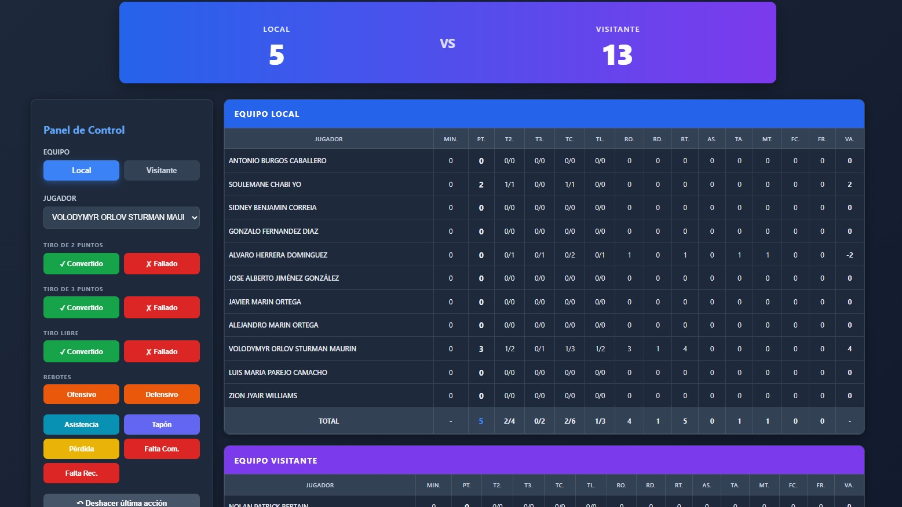
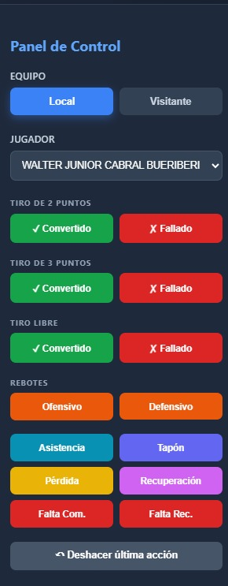

# 📊 Basketball Stats Tracker

Aplicación web para registro de estadísticas de baloncesto en tiempo real.

## 🎯 Características
- Registro en vivo de estadísticas de jugadores
- Cálculo automático de valoración ACB
- Extracción automática de plantillas desde FEB
- Panel de control intuitivo
- Historial con función de deshacer

## 🛠️ Tecnologías
- React 18
- CSS Modules
- Fetch API para web scraping
- DOMParser

## 🚀 Instalación
```bash
git clone https://github.com/tu-usuario/basketball-stats
cd basketball-stats
npm install
npm start
```

## 📸 Capturas







## 👨‍💻 Autor
Rubén García - [LinkedIn] https://www.linkedin.com/in/rub%C3%A9n-garc%C3%ADa-colchero/
```

### Aspectos importantes del repo:
- ✅ **Licencia** (MIT es común para proyectos personales)
- ✅ **.gitignore** bien configurado
- ✅ **Screenshots** en carpeta `/docs` o `/screenshots`
- ✅ **Commits limpios** con mensajes descriptivos
- ✅ **Código comentado** en partes complejas
- ✅ **package.json** con descripción clara

